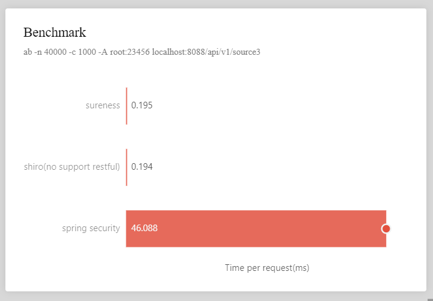

# Benchmark Test   

**sureness VS shiro VS spring security**   

The demo code for testing their performance.   

### Quickly Start   

1. start the demo - (shiro-demo/spring-security-demo/sureness-demo), listen on localhost:8088
2. Installed apache server, https://www.apachelounge.com/download/  
3. cd apache/bin/  
4. ab -n 4000 -c 50 -A root:23456 localhost:8088/api/v1/source1  

### Result  

**environment - 2 cores, 8 GB dell xps on win10.**  

**each demo contains 200 api auth filter chains.**   

    

### Conclusion     

Compared with frameless protection, sureness only consumes a little application performance.  

##### sureness VS shiro    

The performance gap will increase with the size of the project and is twice that of shiro in medium projects.
Shiro cannot natively support restful api.

##### sureness VS spring security    

The performance gap will increase significantly with the size of the project and is 170 times that of spring security in medium projects.

